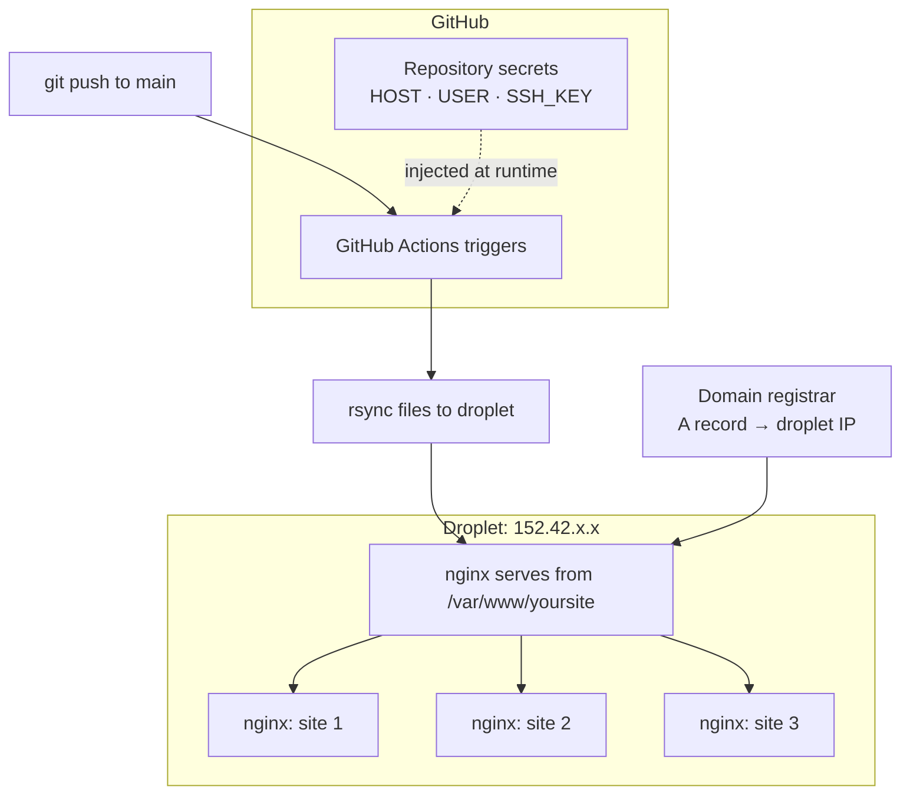

+++
title = "Shipping Static Sites to Production: DNS, Droplets, and GitHub Actions"
date = 2026-03-07T09:00:00+05:30
description = "A practical guide to pointing domains at a VPS, setting up nginx to serve multiple sites, and wiring GitHub Actions to deploy via rsync — no manual SSH after the first time."
tags = ["devops", "github-actions", "nginx", "tutorial", "infrastructure"]
slug = "deploy-static-sites-to-droplet"
draft = false
+++

You have a static site — HTML, CSS, and JavaScript. You want it on a real domain, deploying automatically when you push. This post is the exact playbook I use to get a site from "works locally" to "live at yourdomain.com with zero-touch deployments."

The stack: a DigitalOcean droplet, nginx, and GitHub Actions deploying via rsync.

## The Full Picture

Before getting into steps, here is what the end state looks like:



One droplet can host as many static sites as you want. nginx routes requests by domain name. Each GitHub repo has its own workflow and its own secrets pointing at the same server.

## Step 1: Point Your Domain at the Droplet

Log in to your domain registrar (Namecheap, Cloudflare, wherever you bought the domain). Find the DNS settings.

Create an **A record**:

| Type | Host | Value | TTL |
|------|------|-------|-----|
| A | `@` | `YOUR_DROPLET_IP` | Automatic |
| A | `www` | `YOUR_DROPLET_IP` | Automatic |

The `@` record covers the root domain. The `www` record covers the www subdomain. Both should point at the same IP.

DNS propagation takes between a few minutes and 48 hours, but usually under an hour. You can check it with:

```bash
dig +short yourdomain.com
```

When it returns your droplet IP, DNS is done.

## Step 2: Configure the Droplet

SSH into your server:

```bash
ssh root@YOUR_DROPLET_IP
```

### Install nginx

```bash
apt update && apt install -y nginx
```

### Create the web root

```bash
mkdir -p /var/www/yoursite/html
chown -R www-data:www-data /var/www/yoursite
chmod -R 755 /var/www/yoursite
```

### Write the nginx config

Create `/etc/nginx/sites-available/yoursite.conf`:

```nginx
server {
    listen 80;
    server_name yourdomain.com www.yourdomain.com;

    root /var/www/yoursite/html;
    index index.html;

    location / {
        try_files $uri $uri/ =404;
    }
}
```

Enable it:

```bash
ln -s /etc/nginx/sites-available/yoursite.conf /etc/nginx/sites-enabled/
nginx -t && systemctl reload nginx
```

### Add HTTPS

```bash
apt install -y certbot python3-certbot-nginx
certbot --nginx -d yourdomain.com -d www.yourdomain.com
```

Certbot edits your nginx config automatically and sets up a cron job for renewal. You never touch the certificate again.

### Hosting multiple sites

Each additional site follows the same pattern: a new web root directory, a new nginx config file with a different `server_name`. nginx reads the `Host` header on each request and routes to the right root.

```bash
# second site
mkdir -p /var/www/secondsite/html
```

```nginx
# /etc/nginx/sites-available/secondsite.conf
server {
    listen 80;
    server_name seconddomain.com www.seconddomain.com;
    root /var/www/secondsite/html;
    index index.html;
    location / { try_files $uri $uri/ =404; }
}
```

One server, many sites. Each one is just an nginx config file and a directory.

## Step 3: Set Up SSH Keys for GitHub Actions

GitHub Actions needs to SSH into your droplet to run rsync. Never give it your personal private key. Generate a dedicated one.

On your local machine:

```bash
ssh-keygen -t ed25519 -C "github-actions-deploy" -f /tmp/github_deploy_key -N ""
```

Copy the public key to the droplet:

```bash
ssh root@YOUR_DROPLET_IP \
  "cat >> ~/.ssh/authorized_keys" < /tmp/github_deploy_key.pub
```

Verify it works:

```bash
ssh -i /tmp/github_deploy_key root@YOUR_DROPLET_IP "echo ok"
```

Now copy the contents of the private key. You will store this as a GitHub secret. Then delete the local copies:

```bash
cat /tmp/github_deploy_key   # copy this output
rm /tmp/github_deploy_key /tmp/github_deploy_key.pub
```

The private key lives only in GitHub secrets. It never touches your filesystem after this point.

## Step 4: Add GitHub Secrets

In your GitHub repository, go to **Settings → Secrets and variables → Actions** and add:

| Secret name | Value |
|-------------|-------|
| `DEPLOY_HOST` | Your droplet IP address |
| `DEPLOY_USER` | `root` (or a deploy user if you created one) |
| `DEPLOY_KEY` | The private key you just copied |

These are injected into the workflow at runtime and are never visible in logs.

## Step 5: Write the GitHub Actions Workflow

Create `.github/workflows/deploy.yml` in your repo:

```yaml
name: Deploy

on:
  push:
    branches:
      - main

jobs:
  deploy:
    runs-on: ubuntu-latest
    steps:
      - name: Checkout code
        uses: actions/checkout@v4

      - name: Deploy via rsync
        uses: burnett01/rsync-deployments@7.0.1
        with:
          switches: -avz --delete --exclude='.git*'
          path: ./
          remote_path: /var/www/yoursite/html/
          remote_host: ${{ secrets.DEPLOY_HOST }}
          remote_user: ${{ secrets.DEPLOY_USER }}
          remote_key: ${{ secrets.DEPLOY_KEY }}
```

Push this file to `main`. The workflow runs immediately. GitHub rsyncs your repo contents to the droplet. nginx is already configured to serve from that directory.

Your site is live.

## What Each Secret Does

The workflow references three secrets. Here is why each one exists and what happens if it is wrong:

- **`DEPLOY_HOST`** — the IP or hostname of your server. If this is empty or misspelled, rsync cannot resolve the destination and fails with `Name does not resolve`.
- **`DEPLOY_USER`** — the Linux user on the server. rsync authenticates as this user, so the user must have write access to the `remote_path`.
- **`DEPLOY_KEY`** — the ED25519 private key, pasted verbatim including the `-----BEGIN` and `-----END` lines. If this is malformed or truncated, SSH fails with `error in libcrypto`.

These are the two errors that break most first-time setups. The fixes are always: paste the full key with no extra whitespace, and make sure the host field is not empty.

## Checking a Broken Deploy

If the workflow fails, the logs tell you exactly what went wrong. The two most common failures:

**Key error:**
```
Error loading key "(stdin)": error in libcrypto
```
The private key in your secret is malformed. Re-paste it, making sure to include the full key including header and footer lines.

**Host error:**
```
ssh: Could not resolve hostname : Name does not resolve
```
The `DEPLOY_HOST` secret is empty or has a typo. Check it in Settings → Secrets.

To re-run a failed workflow without pushing new code, use the GitHub CLI:

```bash
gh run rerun <run-id> --failed --repo yourusername/yourrepo
```

Or click **Re-run failed jobs** in the GitHub Actions UI.

## The End State

After this setup, the deployment workflow requires no manual steps:

1. Edit your site locally
2. `git push origin main`
3. GitHub Actions rsyncs to the droplet
4. nginx serves the updated files

DNS points the domain at the droplet. nginx routes requests to the right directory. GitHub Actions handles the transfer. The only thing left is writing.
